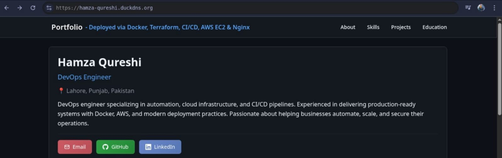

# Portfolio - Deployed via Docker, Terraform, CI/CD, AWS, Nginx

A comprehensive, production-ready FastAPI application with complete CI/CD pipeline, Infrastructure as Code (Terraform), and AWS ECS deployment. Features automated testing, security scanning, multi-environment support, and enterprise-grade monitoring.

[](https://fastapi.tiangolo.com)
[](https://aws.amazon.com/ecs)
[](https://terraform.io)
[](https://docker.com)
[](https://github.com/features/actions)
[](https://github.com/features/security)



---
## 🏗️ Project Architecture

```mermaid
graph LR
    %% ========== Developer ==========
    DEV[👨‍💻 Developer] --> GIT[📚 Git Repository]

    %% ========== CI/CD ==========
    subgraph CICD["⚙️ CI/CD (GitHub Actions)"]
        GIT --> |develop branch| STAGING_PIPE[🧪 Staging Pipeline]
        GIT --> |main branch| PROD_PIPE[🏭 Production Pipeline]

        STAGING_PIPE --> QA[🔍 Code Quality & Tests]
        QA --> BUILD[🏗️ Docker Build & Push]
        BUILD --> DEPLOY_STG[🚀 Deploy Staging]

        PROD_PIPE --> QA
        BUILD --> DEPLOY_PROD[🚀 Deploy Production]
        DEPLOY_PROD --> CLEANUP[🧹 Cleanup]
    end

    %% ========== AWS Infrastructure ==========
    subgraph AWS["☁️ AWS Infrastructure"]
        ALB[⚖️ Load Balancer] --> ECS[📦 ECS Fargate Cluster]
        ECS --> CW[📊 CloudWatch Logs]
        ECS --> ECR[📦 Container Registry]
    end

    %% ========== External ==========
    subgraph EXT["🌍 External Services"]
        DUCK[🦆 DuckDNS Domain]
        GITHUB[🐙 GitHub Container Registry]
    end

    %% Connections
    DEPLOY_STG --> ECS
    DEPLOY_PROD --> ECS
    BUILD --> GITHUB
    ALB --> DUCK
```


---

## 🌟 Core Features

### 🚀 **Application Layer**
- **FastAPI Framework** - Modern, fast Python API with automatic OpenAPI docs
- **Health Monitoring** - Comprehensive health, readiness, and liveness endpoints
- **Performance Metrics** - Built-in system monitoring (CPU, memory, disk)
- **Error Handling** - Structured error responses and logging

### 🏗️ **Infrastructure as Code**
- **Terraform Modules** - Reusable, versioned infrastructure components
- **Multi-Environment** - Separate staging and production environments
- **Auto-Scaling** - Dynamic scaling based on CPU and memory utilization
- **High Availability** - Multi-AZ deployment with load balancing

### 🔄 **CI/CD Pipeline**
- **9-Stage Pipeline** - Comprehensive automation from code to production
- **Security First** - Multiple security scans (code, dependencies, containers)
- **Multi-Platform** - ARM64 and AMD64 container builds
- **Environment Protection** - Approval workflows for production deployments

### 🛡️ **Security & Monitoring**
- **Vulnerability Scanning** - Automated security checks with Trivy and Bandit
- **Dependency Management** - Automated updates with Dependabot
- **CloudWatch Integration** - Centralized logging and monitoring
- **Health Checks** - Multi-layer health verification

---

## 🏛️ Technology Stack

<table>
<tr><th>Layer</th><th>Technology</th><th>Version</th><th>Purpose</th></tr>
<tr><td>🌐 <b>API</b></td><td>FastAPI</td><td>0.104+</td><td>High-performance async API framework</td></tr>
<tr><td>🐍 <b>Runtime</b></td><td>Python</td><td>3.11</td><td>Modern Python with performance optimizations</td></tr>
<tr><td>📦 <b>Containers</b></td><td>Docker</td><td>Latest</td><td>Multi-platform containerization</td></tr>
<tr><td>🏗️ <b>Infrastructure</b></td><td>Terraform</td><td>1.6+</td><td>Infrastructure as Code</td></tr>
<tr><td>☁️ <b>Platform</b></td><td>AWS ECS Fargate</td><td>Latest</td><td>Serverless container platform</td></tr>
<tr><td>⚖️ <b>Load Balancer</b></td><td>AWS ALB</td><td>Latest</td><td>Application-layer load balancing</td></tr>
<tr><td>🌍 <b>Proxy</b></td><td>Nginx Alpine</td><td>Latest</td><td>Reverse proxy and static file serving</td></tr>
<tr><td>📊 <b>Monitoring</b></td><td>CloudWatch</td><td>Latest</td><td>Centralized logging and metrics</td></tr>
<tr><td>🔄 <b>CI/CD</b></td><td>GitHub Actions</td><td>Latest</td><td>Automated deployment pipeline</td></tr>
<tr><td>🌐 <b>Domain</b></td><td>DuckDNS</td><td>Latest</td><td>Dynamic DNS service</td></tr>
</table>

---
## 🌐 CI/CD Pipeline Deep Dive

### Pipeline Summary


### Detailed Stage Breakdown

| Stage | Purpose | Tools | Triggers |
|-------|---------|-------|----------|
| **Code Quality** | Linting, formatting, security | Black, isort, flake8, bandit | Every push/PR |
| **Testing** | Unit tests, coverage | pytest, coverage | Every push/PR |
| **Build** | Multi-platform containers | Docker Buildx | Every push/PR |
| **Security Scan** | Container vulnerabilities | Trivy | Non-PR pushes |
| **Integration** | End-to-end testing | Docker Compose | Every push/PR |
| **Terraform Plan** | Infrastructure preview | Terraform | develop/main branches |
| **Deploy Staging** | Automatic staging deploy | Terraform Apply | develop branch |
| **Deploy Production** | Production deployment | Terraform Apply | main branch |
| **Cleanup** | Resource maintenance | AWS CLI | After deployments |


---

## 📁 Project Structure

```
fastapi-production-platform/
├── 🚀 app/                           # Application Source Code
│   ├── __init__.py
│   ├── main.py                       # FastAPI app with health endpoints
│   ├── data.py                       # Data models and business logic
│   ├── static/                       # Static assets (CSS, JS, images)
│   │   └── style.css
│   └── templates/                    # Jinja2 HTML templates
│       └── index.html
│
├── 🏗️ terraform/                     # Infrastructure as Code
│   ├── main.tf                       # Main infrastructure configuration
│   ├── variables.tf                  # Configurable input variables
│   ├── outputs.tf                    # Infrastructure outputs
│   ├── ecs.tf                        # ECS services and tasks
│   ├── environments/                 # Environment-specific configs
│   │   ├── staging.tfvars           # Staging environment variables
│   │   └── production.tfvars        # Production environment variables
│   └── backend-config/              # Terraform state backends
│       ├── staging.hcl              # Staging state configuration
│       └── production.hcl           # Production state configuration
│
├── 🛠️ scripts/                       # Automation Scripts
│   ├── setup.sh                     # Initial project setup
│   ├── deploy.sh                    # Manual deployment script
│   ├── destroy.sh                   # Infrastructure cleanup
│   ├── health-check.sh              # Application health verification
│   └── logs.sh                      # Log aggregation utility
│
├── 🔄 .github/                       # GitHub Automation
│   ├── workflows/
│   │   └── ci-cd.yml                # Complete CI/CD pipeline
│   └── dependabot.yml               # Automated dependency updates
│
├── 🧪 tests/                         # Comprehensive Test Suite
│   ├── __init__.py
│   ├── test_main.py                 # Unit tests
│   ├── test_health.py               # Health endpoint tests
│   └── integration/                 # Integration tests
│       └── test_api.py
│
├── 🌐 nginx/                         # Reverse Proxy Configuration
│   ├── default.conf                 # Nginx server configuration
│   └── html/                        # Static HTML files
│
├── 📦 Container Configuration
│   ├── docker-compose.yml           # Local development setup
│   ├── docker-compose.override.yml  # Development overrides
│   ├── Dockerfile                   # Production container image
│   └── .dockerignore               # Container build exclusions
│
├── ⚙️ Configuration Files
│   ├── requirements.txt             # Python dependencies
│   ├── pytest.ini                  # Testing configuration
│   ├── .flake8                     # Code linting rules
│   ├── pyproject.toml              # Modern Python project config
│   └── Makefile                    # Development commands
│
└── 📚 Documentation
    ├── README.md                    # This comprehensive guide
    └── LICENSE                      # Project license
```


---


## 📊 Monitoring and Observability

### Health Endpoints
- **`/health`** - Comprehensive system health with metrics
- **`/ready`** - Service readiness check
- **`/live`** - Liveness probe for container orchestration

### CloudWatch Metrics
- Application logs with structured JSON
- ECS service metrics (CPU, memory, network)
- ALB metrics (request count, latency, errors)
- Custom business metrics

### Alerting Setup
```bash
# Set up CloudWatch alarms (optional)
aws cloudwatch put-metric-alarm \
  --alarm-name "HighCPUUtilization" \
  --alarm-description "Alarm when CPU exceeds 70%" \
  --metric-name CPUUtilization \
  --namespace AWS/ECS \
  --statistic Average \
  --period 300 \
  --threshold 70 \
  --comparison-operator GreaterThanThreshold
```

---

## 🎯 Environment Management

### Staging Environment
- **Purpose**: Integration testing and validation
- **Resources**: 1 task, 256 CPU, 512 MB memory
- **Domain**: `staging.hamza-qureshi.duckdns.org`
- **Auto-deploy**: From `develop` branch

### Production Environment  
- **Purpose**: Live application serving users
- **Resources**: 2 tasks, 512 CPU, 1024 MB memory
- **Domain**: `hamza-qureshi.duckdns.org`
- **Deploy**: Manual approval required

### Resource Scaling
```hcl
# Auto-scaling configuration in terraform/ecs.tf
resource "aws_appautoscaling_target" "ecs_target" {
  max_capacity = 10  # Maximum tasks
  min_capacity = 1   # Minimum tasks
  # Scales based on CPU (70%) and Memory (80%)
}
```

---

## 🛠️ Troubleshooting Guide

### Common Issues

#### 🚨 Deployment Failures
```bash
# Check ECS service status
aws ecs describe-services --cluster fastapi-app-cluster --services fastapi-app

# View task failures
aws ecs describe-tasks --cluster fastapi-app-cluster --tasks TASK_ID

# Check CloudWatch logs
aws logs tail /ecs/fastapi-app --follow
```

#### 🔍 Health Check Failures
```bash
# Test health endpoint locally
curl -f http://localhost:8000/health

# Check load balancer health
aws elbv2 describe-target-health --target-group-arn TARGET_GROUP_ARN

# Verify security groups
aws ec2 describe-security-groups --group-ids SECURITY_GROUP_ID
```

#### 🏗️ Terraform Issues
```bash
# Unlock state if locked
terraform force-unlock LOCK_ID

# Refresh state
terraform refresh -var-file=environments/staging.tfvars

# Plan with detailed logging
TF_LOG=DEBUG terraform plan
```

### Performance Optimization
- Monitor CloudWatch metrics for scaling decisions
- Optimize container resource allocation
- Use Application Load Balancer access logs
- Implement caching strategies for static content

---

## 🔒 Security Setup

### 🔑 GitHub Repository Secrets
Configure these secrets in `Settings > Secrets and variables > Actions`:

```bash
AWS_ACCESS_KEY_ID=AKIA...           # AWS programmatic access key
AWS_SECRET_ACCESS_KEY=...           # AWS secret access key  
DUCKDNS_TOKEN=...                   # DuckDNS token (optional)
```

### 🏛️ AWS IAM Configuration
Create an IAM user with these permissions:
- `AmazonECS_FullAccess`
- `AmazonEC2FullAccess`
- `ElasticLoadBalancingFullAccess`
- `IAMFullAccess`
- `CloudWatchFullAccess`
- `AmazonS3FullAccess`

### 🛡️ Security Features
- **Vulnerability Scanning** - Trivy container scanning
- **Code Security** - Bandit Python security linting
- **Dependency Scanning** - Safety package vulnerability checks
- **Automated Updates** - Dependabot security patches
- **Secrets Management** - GitHub encrypted secrets
- **Network Security** - VPC with security groups

---

## 🔄 Maintenance and Updates

### Regular Maintenance Tasks
```bash
# Update dependencies (automated via Dependabot)
pip list --outdated

# Clean up old container images
make cleanup

# Review and rotate AWS credentials
aws iam list-access-keys --user-name github-actions-user

# Update Terraform modules
terraform init -upgrade
```

### Disaster Recovery
- **State Management**: Terraform state stored in versioned S3 bucket
- **Backup Strategy**: Infrastructure recreatable from code
- **Rollback Process**: Git revert + terraform apply
- **Multi-AZ Deployment**: Automatic failover capabilities

---

## 📈 Scaling and Performance

### Horizontal Scaling
- **Auto-scaling**: CPU and memory-based scaling rules
- **Load Distribution**: Multi-AZ deployment with ALB
- **Database Scaling**: Ready for RDS integration

### Performance Monitoring
```bash
# Monitor application performance
aws cloudwatch get-metric-statistics \
  --namespace AWS/ApplicationELB \
  --metric-name TargetResponseTime \
  --start-time 2024-01-01T00:00:00Z \
  --end-time 2024-01-01T23:59:59Z \
  --period 3600 \
  --statistics Average
```

---

## 📄 License

This project is licensed under the MIT License - see the [LICENSE](LICENSE) file for details.

---

<div align="center">

**⭐ find this portfolio impressive? give it a star**

</div>
